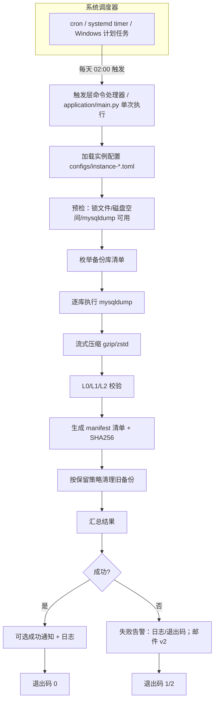
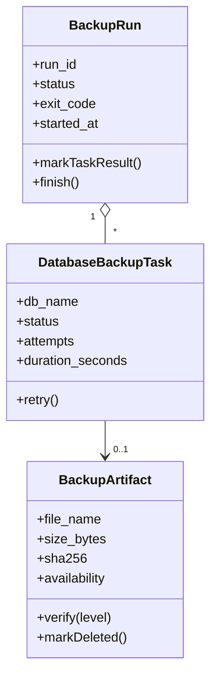

# PRD：MySQL 每日定时备份系统

| 项目名称 | mysql-daily-scheduled-backup |
| --- | --- |
| 文档版本 | v0.5（草稿，待评审） |
| 编写日期 | 2026-08-13 |
| 文档状态 | 评审中 |
| 作者 | Codex / 用户 |
| 评审人 | 待填 |

## 修订记录

| 版本 | 日期 | 修订说明 | 作者 |
| --- | --- | --- | --- |
| v0.5 | 2026-08-18 | 保留期由 10 天调整为 1 天（日备），同步更新第 4/5/8/12/13 章与配置样例 | Codex / 用户 |
| v0.4 | 2026-08-18 | 确认第 13 章评审结论：MySQL 8.0（驱动 mysql-connector-java-8.0.23）、2 实例约 13 库、约 8 库各 3-5GB、生产 Linux/本地 Windows、本地目录存储、目标盘约 5GB（需扩容）、保留 10 天、QQ 邮箱告警 v2 上线、需要表结构单独文件、无存量脚本、每日 02:00，并同步更新第 4/5/6/7/8/10/12/13 章 | Codex / 用户 |
| v0.3 | 2026-08-18 | 分层调整：接口层改为触发层（Trigger），实现 RunBackupCommandHandler / RestoreBackupCommandHandler，应用层（Application）承载 main.py / cli.py；去除重复内容（1.3 与 3.2、目录结构草图、恢复命令速查） | Codex / 用户 |
| v0.2 | 2026-08-13 | 增补 7.4 领域建模（DDD-lite）：限界上下文、统一语言、战术建模、端口与适配器、防腐层 | Codex / 用户 |
| v0.1 | 2026-08-10 | 初稿：语言选型、总体架构、详细设计、验收标准 | Codex / 用户 |

---

## 1. 背景与目标

### 1.1 背景

MySQL 是核心业务数据存储，当前缺少**自动化、可验证、可恢复**的每日备份机制。人工备份存在以下风险：

- 忘记备份或备份不及时，数据丢失后无法恢复；
- 备份文件散落、命名混乱，无法确认"哪份是最新可用备份"；
- 只备份数据文件、未备份表结构/存储过程/触发器/事件，恢复不完整；
- 没有保留策略，磁盘被历史备份占满；
- 备份失败无人感知，直到需要恢复时才发现备份不可用。

### 1.2 目标

1. 每日自动对 MySQL **表结构 + 数据** 进行全量逻辑备份；
2. 备份内容完整：表、视图、索引、存储过程、函数、触发器、事件；
3. 备份文件统一压缩、规范命名、按日期归档、可追溯（manifest 清单）；
4. 具备保留策略，自动清理过期备份；
5. 具备多级完整性校验（文件级 → 结构级 → 可恢复级）；
6. 备份成功/失败可告警，日志可审计；
7. 提供标准恢复流程与脚本，支持全库/单库恢复；
8. 最小化第三方依赖、跨平台可部署、配置化。

### 1.3 非目标（v1 不做，列入 v2 规划）

v1 不实现的能力统一列入 v2 规划，完整清单见 3.2。

---

## 2. 术语表

| 术语 | 说明 |
| --- | --- |
| 逻辑备份 | 通过 mysqldump 导出为 SQL 文本，可跨版本/跨平台恢复 |
| 物理备份 | 直接拷贝数据文件（如 XtraBackup），速度快但强依赖版本 |
| 全量备份 | 备份一个数据库的全部结构 + 全部数据 |
| 保留策略 | 按时间/份数决定备份文件保留多久、何时清理 |
| RPO | 恢复点目标，最大可接受的数据丢失时间 |
| RTO | 恢复时间目标，最大可接受的恢复耗时 |
| manifest | 备份清单，记录每次备份的库、时间、大小、校验值、状态 |
| 影子库 | 用于恢复演练的临时数据库，验证备份可恢复性 |

---

## 3. 范围

### 3.1 v1 范围

- 2 个 MySQL 实例（约 13 个业务库：3 + 10）的每日全量备份，多实例通过多份配置/多任务支持；
- 支持"全部业务库 / 指定库 / 指定表"三种范围；
- 表结构 + 数据 + 存储过程/函数/触发器/事件；
- 表结构单独文件（仅结构 `{db}_schema_*.sql.gz`，已确认需要，用于跨环境建表）；
- 备份文件压缩（gzip，可选 zstd）；
- 校验：文件完整性 + 可选结构比对 + 可选影子库恢复演练；
- 保留策略与自动清理；
- 失败重试与告警（v1 以日志/退出码兜底并预留 SMTP/Webhook 适配；QQ 邮箱邮件告警 v2 上线）；
- 结构化日志 + 运行状态/清单文件；
- 恢复脚本与文档。

### 3.2 v2 规划（本版不实现）

- binlog 增量备份与 PITR（时间点恢复）；
- XtraBackup 物理备份模式；
- 对象存储/异地备份同步；
- 备份加密（GPG/age）；
- 定时自动恢复演练；
- 可视化界面 / Web 管理台；
- QQ 邮箱（SMTP）邮件告警渠道；
- 多实例集中管理/备份编排中心。

---

## 4. 现状与假设（已确认）

| 项 | 假设 | 影响 |
| --- | --- | --- |
| MySQL 版本 | 8.0（客户端驱动 mysql-connector-java-8.0.23，部署时冒烟确认服务端版本） | mysqldump 按 8.0 校验参数（如 `--set-gtid-purged=OFF`） |
| 实例与库数量 | 2 个 MySQL 实例：实例 A 约 3 库、实例 B 约 10 库（合计约 13 库） | 多实例通过多份配置/多任务支持，每实例独立预检 |
| 服务器操作系统 | 生产 Linux（cron/systemd）；本地测试 Windows | 调度方式不同，核心脚本跨平台 |
| 数据总量 | 约 8 个库各 3-5GB，其余库数据量可忽略（合计约 25-40GB） | 逻辑备份每日一次可接受；压缩后单日备份约数 GB |
| 存储引擎 | 以 InnoDB 为主 | 使用 `--single-transaction` 保证一致性；MyISAM 需告警 |
| 备份存储位置 | 生产存 Linux 服务器本地目录；本地测试存本地目录 | 需预留 ≥ 单日压缩备份 × 保留天数 的空间 |
| 目标盘可用空间 | 约 5GB（⚠️ 保留 1 天下仍可能偏紧，需实测单日压缩备份体积，见 12 章） | 磁盘预检门槛；现场实测后确认是否扩容 |
| 保留期 | 1 天（日备，已确认） | 默认保留 1 天；周/月备默认关闭 |
| 告警渠道 | QQ 邮箱（SMTP 邮件），v2 上线 | v1 以日志/退出码兜底，预留 SMTP/Webhook 适配 |
| 表结构单独文件 | 需要 | `schema_only=true`，输出 `{db}_schema_*.sql.gz` |
| 现有手工备份脚本 | 无 | 无需兼容旧约定 |
| 备份执行时间 | 每日 02:00（已确认可接受） | 部署脚本按此生成调度 |
| 网络 | 备份任务与 MySQL 同机或内网可达 | 不依赖公网 |
| 本地开发环境 | 本地有 Python 3.13.13，无 mysqldump 客户端 | 本地做单元测试/逻辑开发，真实备份在服务器验证 |

> ✅ 上述假设已经评审确认（见第 13 章）；其中「目标盘约 5GB」在保留 1 天条件下仍可能偏紧，见第 12 章风险与对策。

---

## 5. 需求

### 5.1 功能需求

| 编号 | 需求 | 优先级 | 说明 |
| --- | --- | --- | --- |
| FR-01 | 每日定时自动执行备份 | P0 | 由系统调度器（cron/systemd timer/Windows 计划任务）触发，脚本单次执行 |
| FR-02 | 备份范围可配置 | P0 | `all`（排除系统库）/ 指定库列表 / 指定库+表 |
| FR-03 | 结构 + 数据完整备份 | P0 | 包含表、视图、索引、存储过程、函数、触发器、事件 |
| FR-04 | 压缩输出 | P0 | 默认 gzip，可选 zstd/none；流式压缩避免中间大文件 |
| FR-05 | 文件规范命名与归档 | P0 | `{db}_{YYYYMMDD}_{HHMMSS}.sql.gz`，按日期目录归档 |
| FR-06 | manifest 清单 | P0 | 每次运行生成 JSON 清单：库、耗时、大小、SHA256、状态 |
| FR-07 | 保留策略与自动清理 | P0 | 默认日备保留 1 天（已确认）；可配置保留天数/份数/多级（日/周/月，v1 默认仅日备） |
| FR-08 | 完整性校验 | P0 | L0 文件级（非空、gzip 合法、含 Dump completed 尾标记） |
| FR-09 | 结构校验 | P1 | L1 解压统计 CREATE TABLE 数量与 information_schema 比对 |
| FR-10 | 恢复演练校验 | P1 | L2 可选：恢复到影子库，比对表数量/行数 |
| FR-11 | 失败重试 | P1 | 单库失败自动重试 1 次（可配置） |
| FR-12 | 告警通知 | P0 | 失败/部分失败必告警；成功可选；v1 以日志/退出码兜底并预留 SMTP/Webhook 适配；QQ 邮箱（SMTP）渠道 v2 上线 |
| FR-13 | 结构化日志 | P0 | 时间/级别/run_id/库名/耗时；日志轮转；敏感信息脱敏 |
| FR-14 | 并发保护 | P1 | 锁文件防止上一轮未结束时重复执行 |
| FR-15 | 磁盘空间预检 | P1 | 备份前检查目标盘可用空间，不足则告警中止 |
| FR-16 | 恢复脚本 | P1 | 提供全库/单库恢复脚本与文档 |
| FR-17 | 凭据安全 | P0 | 密码不落库、不打印、不入日志；配置文件权限 600 |
| FR-18 | 表结构单独备份 | P1 | 已确认需要：输出 `{db}_schema_*.sql.gz`（仅结构，用于跨环境建表） |
| FR-19 | 退出码约定 | P1 | 0=全部成功；1=部分失败；2=全部失败/异常 |

### 5.2 非功能需求

| 编号 | 需求 | 指标/说明 |
| --- | --- | --- |
| NFR-01 | 对业务影响 | InnoDB 使用 `--single-transaction`，不加全局锁；备份期间不阻塞读写 |
| NFR-02 | 兼容性 | 目标环境 MySQL 8.0（兼容 5.7）；Python 3.9+（目标 3.13）；Linux / Windows |
| NFR-03 | 可靠性 | 单库失败不影响其他库；失败可重试；退出码可被调度器感知 |
| NFR-04 | 可运维性 | 全配置化（TOML）；日志/清单可直接定位问题；部署脚本化 |
| NFR-05 | 安全 | 最小权限备份账号；凭据走环境变量/独立 600 权限文件；日志脱敏 |
| NFR-06 | 可测试性 | 核心逻辑与 mysqldump 解耦，可用 mock 单测；提供集成测试方案 |
| NFR-07 | 性能 | 流式管道压缩，避免落盘中间文件；备份耗时记录并纳入告警阈值 |

---

## 6. 技术选型

### 6.1 语言选型：Python 3.13（推荐） vs Java 1.8

| 维度 | Python 3.13 ✅ | Java 1.8 ❌ |
| --- | --- | --- |
| 部署环境 | 服务器已有 Python 3.13；**本地也已安装 3.13.13**（F:\tools\Python313） | 服务器是否有 JDK8 待确认；若没有需额外安装 |
| 任务性质 | 本质是编排 `mysqldump` 子进程 + 文件/日志/通知，脚本语言天然合适 | 样板代码多，需 Maven/Gradle 构建与打包分发 |
| 依赖 | 标准库即可：`subprocess`、`tomllib`、`logging`、`gzip`、`hashlib`、`json`，**零第三方依赖** | 需 JDBC 驱动、日志框架、配置框架 |
| 跨平台 | Linux/Windows 通吃 | 依赖 JVM，Linux 服务器维护成本更高 |
| 开发迭代 | 单文件可改可测，反馈快 | 编译-打包-部署链路长 |
| 生命周期 | Python 3.13 活跃维护 | Java 8 已停止免费更新，老旧且存在安全合规风险 |
| 运维 | 服务器直接 `python3 application/main.py` 运行 | 需维护 jar 产物与 JVM 参数 |

**结论：采用 Python 3.13**。理由：两端环境都已具备、零依赖、开发快、运维轻；备份场景对执行性能不敏感，Python 完全胜任。

### 6.2 备份工具选型：mysqldump（v1 主方案）

| 工具 | 类型 | 优点 | 缺点 | 结论 |
| --- | --- | --- | --- | --- |
| **mysqldump** | 逻辑 | MySQL 自带零安装；兼容 5.7/8.0；支持结构+数据+例程/触发器/事件；细粒度（单库/单表）恢复 | 大数据量慢；锁策略需正确配置 | ✅ v1 默认 |
| mysqlpump | 逻辑 | 并行导出更快 | 部分版本已进入弃用流程；输出与 mysqldump 有差异 | ❌ |
| Percona XtraBackup | 物理 | 快、低影响、支持增量 | 需安装；与 MySQL 版本强绑定；恢复流程复杂 | v2 大数据量评估 |
| mydumper | 逻辑 | 并行快 | 需安装、版本兼容性维护成本 | 可选 |

**结论：v1 使用 mysqldump**，工具路径与附加参数可配置；后续数据量增长时在配置层扩展 `mode = "xtrabackup"`。

### 6.3 调度方式：系统原生调度器（推荐）

| 方式 | 优点 | 缺点 | 结论 |
| --- | --- | --- | --- |
| **cron / systemd timer** | 系统级、稳定、无需常驻进程；失败可见（退出码/日志） | 仅 Linux | ✅ Linux 首选 |
| Windows 计划任务 | 系统级、图形化 | 仅 Windows | Windows 用 |
| 脚本内常驻调度（APScheduler） | 跨平台统一 | 需守护进程、崩溃恢复复杂、重复造轮子 | ❌ v1 不用 |

**结论：脚本只做"单次执行"，调度交给操作系统**。提供 Linux cron 安装脚本与 Windows 计划任务脚本。

### 6.4 配置格式与依赖

- 配置格式：**TOML**（Python 3.11+ 标准库 `tomllib` 直接读取，零依赖）；
- v1 依赖：**仅 Python 标准库**，不引入第三方包；
- 测试：`unittest` + `unittest.mock`（标准库）。

### 6.5 选型结论汇总

| 项 | 选择 |
| --- | --- |
| 语言 | Python 3.13（标准库实现） |
| 备份引擎 | mysqldump（逻辑全量备份） |
| 压缩 | gzip（默认）/ zstd（可选） |
| 调度 | cron / systemd timer / Windows 计划任务 |
| 配置 | TOML |
| 告警 | v1 日志/退出码兜底（预留 SMTP/Webhook 适配）；QQ 邮箱 SMTP 邮件 v2 上线 |
| 校验 | L0 文件级 + L1 结构级 + L2 影子库（可选） |

---

## 7. 总体架构

### 7.1 架构图



### 7.2 核心流程（端到端）

1. **调度触发**：系统调度器按配置时间（默认 02:00）触发 `RunBackupCommandHandler`，应用层 `python3 application/main.py` 单次执行；
2. **加载配置**：按 `--config` 读取对应实例配置（`configs/instance-*.toml`）与 `configs/.env` 凭据；
3. **预检**：检查并发锁、目标盘剩余空间、`mysqldump` 可执行、MySQL 连通性；
4. **确定备份清单**：`all` 模式通过 `SHOW DATABASES` 排除系统库；或使用配置的白名单；
5. **逐库备份**：对每个库执行 `mysqldump ... | gzip > 目标文件`，记录耗时与退出码，失败自动重试（默认 1 次）；
6. **校验**：L0 文件非空/gzip 合法/含 `Dump completed` 尾标记；L1 统计建表语句数与源库比对（可选）；L2 影子库恢复比对（可选）；
7. **生成清单**：`manifest_YYYYMMDD.json` 记录每个库的耗时、大小、SHA256、状态；
8. **清理**：按保留策略删除过期备份；
9. **通知与退出**：成功可选通知（v1 写日志）；失败必告警（v1 日志/退出码，邮件告警 v2）；退出码 0/1/2 供调度器感知。

### 7.3 领域建模（DDD-lite 架构）

#### 7.3.1 DDD 适用性评估

| 判断维度 | 评估 | 结论 |
| --- | --- | --- |
| 业务复杂度 | 备份编排、保留策略、校验语义中等偏低，无复杂业务流程 | 不需要完整 DDD 全套 |
| 规则稳定性 | 保留/校验/部分失败语义是核心规则，值得独立建模与单测 | 适合战术建模 |
| 外部集成 | mysqldump / mysql CLI 是强外部依赖，需隔离替换 | 需要 ACL 与端口适配器 |
| 团队规模 | 单人/小团队、单进程脚本工程 | 轻量分层即可 |

**结论：采用 DDD-lite** = 四层架构（领域 / 应用 / 触发 / 基础设施）+ 战术建模（聚合、实体、值对象、领域服务、领域事件）+ 端口与适配器 + 防腐层（ACL）。

**明确不做**：CQRS、事件溯源、消息总线、独立持久化中间件。manifest JSON 即聚合的投影（Repository 落盘），够用且可审计。

#### 7.3.2 限界上下文

| 限界上下文 | 职责 | 核心概念 |
| --- | --- | --- |
| 备份编排 Backup Execution | 调度触发后的备份运行生命周期、重试、退出码 | BackupRun、DatabaseBackupTask |
| 备份档案管理 Backup Archive | 文件命名、manifest、保留策略、清理 | BackupArtifact、RetentionPolicy、CleanupPlan |
| 校验与恢复 Verification & Restore | L0/L1/L2 校验、影子库演练、恢复门禁 | VerificationLevel、Availability、RestoreDrill |
| 通知 Notification | 领域事件 → 渠道适配（webhook/邮件/日志） | NotificationEvent、Notifier 端口 |

#### 7.3.3 统一语言（领域术语表）

| 中文术语 | 英文 | 定义 |
| --- | --- | --- |
| 备份运行 | BackupRun | 一次调度触发的完整备份过程（聚合根） |
| 数据库备份任务 | DatabaseBackupTask | 单个库的一次备份作业 |
| 备份产物 | BackupArtifact | 备份产生的文件（.sql.gz），含路径/大小/SHA256 |
| 备份清单 | BackupManifest | 一次运行的持久化记录（领域事件投影） |
| 保留策略 | RetentionPolicy | 日/周/月分级保留规则 |
| 清理计划 | CleanupPlan | 保留服务计算出的删除清单（纯函数输出） |
| 校验级别 | VerificationLevel | L0 / L1 / L2 |
| 可用性 | Availability | Available / Unavailable / PendingVerify |
| 运行锁 | RunLock | 并发保护机制 |
| 影子库演练 | RestoreDrill | L2 校验/恢复演练 |
| 转储结果 | DumpResult | mysqldump 执行结果翻译后的领域对象 |

#### 7.3.4 战术建模：聚合、实体、值对象



- **聚合根 BackupRun**：一次备份运行的生命周期，聚合 DatabaseBackupTask；一致性边界 = "单次运行内所有任务状态"；
- **实体 BackupArtifact**：文件生命周期（生成 → 校验 → Available/Unavailable → 清理删除）；
- **值对象**：DbName、BackupTime（含时区）、FileName（命名规则）、Compression（GZIP/ZSTD/NONE）、BackupScope（ALL/LIST/TABLES）、RetentionTier（DAILY/WEEKLY/MONTHLY）、RetentionWindow、VerificationLevel、ExitCode、Sha256、SizeBytes、DumpResult；
- **领域服务**：
  - `BackupExecutionService`：编排逐库 dump、应用重试策略、维护运行状态；
  - `RetentionService`：纯函数计算 CleanupPlan（无 IO，可单测）；
  - `VerificationService`：执行 L0/L1/L2 并更新 Availability；
- **领域事件**：BackupRunStarted、DatabaseBackupSucceeded、DatabaseBackupFailed、BackupRunCompleted、VerificationFailed、ArtifactDeleted、DiskSpaceLow。

#### 7.3.5 分层架构与依赖规则

| 层 | 职责 | 依赖 | 代表模块 |
| --- | --- | --- | --- |
| 领域层 Domain | 纯业务规则，零 IO | 仅标准库类型 | model / services / events / repositories（接口） |
| 应用层 Application | 应用入口与会话：参数解析、装配依赖、用例编排、退出码 | 领域层 | main.py / cli.py |
| 触发层 Trigger | 接收外部触发（调度器定时 / CLI 命令），实现命令处理器，调用应用层用例 | 应用层 | RunBackupCommandHandler、RestoreBackupCommandHandler |
| 基础设施层 Infrastructure | 外部工具与 IO 适配 | 实现领域层接口 | mysqldump_client、mysql_client、file_storage、compressor、notifier、manifest_repository、config_loader |

依赖规则：
1. 单向依赖：触发层 → 应用层 → 领域层；基础设施层实现领域层接口；
2. 依赖倒置：领域层只定义端口（接口），不 import 任何基础设施；
3. 领域层不出现 subprocess / 文件 IO / 网络 / 时间（时间通过 Clock 端口注入）。

#### 7.3.6 防腐层（ACL）：封装 mysqldump

mysqldump 是外部遗留工具：参数多、退出码语义与业务不同、输出含 `Dump completed` 标记、5.7/8.0 参数有差异。

`MysqldumpClient`（ACL 适配器）职责：
- 组装命令与流式压缩管道（`mysqldump ... | gzip > file.sql.gz`）；
- 执行并捕获 stdout/stderr/退出码；
- 翻译为领域对象 `DumpResult`（成功/失败/错误摘要），或抛出 `DumpFailed` 领域异常；
- 按 MySQL 版本差异生成参数（如 `--set-gtid-purged`）。

**收益**：未来换 XtraBackup / mydumper 只改这一个适配器，领域层零改动。

#### 7.3.7 端口与适配器清单

| 端口（领域接口） | 适配器（基础设施实现） | 说明 |
| --- | --- | --- |
| DumpExecutor | MysqldumpClient | 执行备份转储 |
| MySqlGateway | MysqlCliClient | 枚举库、查表数、影子库比对 |
| ArtifactStorage | LocalFileStorage | 写/列/删/校验备份文件 |
| Compressor | GzipCompressor / ZstdCompressor / NoopCompressor | 压缩策略 |
| Notifier | WebhookNotifier / SmtpNotifier / LogNotifier | 告警通知 |
| Clock | SystemClock | 时间（测试注入 FakeClock） |
| BackupRunRepository | JsonManifestRepository | manifest JSON 读写 |

#### 7.3.8 DDD 视角的端到端流程

1. 调度器/CLI 触发 → 触发层 `RunBackupCommandHandler` / `RestoreBackupCommandHandler` 接收命令；
2. 触发层调用应用层（application/main.py、cli.py）完成装配：加载配置、准备命令上下文；
3. `BackupRunFactory` 创建 BackupRun 聚合（时间/范围/策略快照）→ 发布 BackupRunStarted；
4. `BackupExecutionService` 遍历任务：调用 DumpExecutor 端口 → 领域按 DumpResult 更新任务状态（成功/失败/重试）；
5. 聚合完成 → 领域规则计算运行状态与退出码 → 发布 BackupRunCompleted；
6. `VerificationService` 按策略校验 → 更新 BackupArtifact.availability；
7. `RetentionService` 纯函数计算 CleanupPlan → ArtifactStorage 执行删除 → 发布 ArtifactDeleted；
8. 应用层 notify.py 订阅事件：失败事件 → Notifier 端口告警；成功可选通知；
9. `BackupRunRepository.save(run)` → manifest JSON（聚合投影），供审计与恢复门禁读取。

#### 7.3.9 工程目录结构（落地以此为准）

```text
mysql-daily-scheduled-backup/
├── configs/                      # 每实例一份配置（instance-a/instance-b）+ .env 凭据（.env 已 gitignore）
├── requirements.txt               # v1 为空（纯标准库），预留
├── README.md                      # 快速开始、部署、恢复说明
├── application/
│   ├── main.py                    # 应用层：程序入口，装配依赖、设置退出码
│   ├── cli.py                     # 应用层：CLI 参数解析与命令分发
│   ├── cleanup.py                 # 应用层：保留策略清理用例
│   └── notify.py                  # 应用层：事件订阅 → 告警通知
├── trigger/
│   ├── run_backup.py              # 触发层：RunBackupCommandHandler
│   └── restore_backup.py          # 触发层：RestoreBackupCommandHandler
├── domain/
│   ├── model/
│   │   ├── aggregates/
│   │   │   └── backup_run.py          # 聚合根
│   │   ├── entities/
│   │   │   ├── database_backup_task.py
│   │   │   └── backup_artifact.py
│   │   └── value_objects/
│   │       └── value_objects.py       # DbName/Compression/RetentionTier/...
│   ├── services/
│   │   ├── backup_execution.py
│   │   ├── retention.py           # 纯函数 CleanupPlan
│   │   └── verification.py
│   ├── events.py                  # 领域事件
│   └── repositories.py            # 仓库接口（端口）
├── infrastructure/
│   ├── mysqldump_client.py        # 防腐层：mysqldump 适配
│   ├── mysql_client.py            # MySqlGateway 适配
│   ├── file_storage.py            # ArtifactStorage 适配
│   ├── compressor.py              # gzip/zstd/noop
│   ├── notifiers.py               # webhook/smtp/log
│   ├── manifest_repository.py     # JSON 仓库实现
│   └── config_loader.py           # TOML + 环境变量
├── scripts/
│   ├── install_cron.sh
│   ├── install_systemd.sh
│   ├── install_task.ps1
│   └── restore.sh
├── tests/
│   ├── unit/                      # 领域纯逻辑单测（无 IO）
│   └── integration/               # mock 命令的集成测试
└── docx/
    ├── PRD.md
    └── PLAN.md
```

#### 7.3.10 核心领域规则（可单测样例）

| 规则 | 描述 |
| --- | --- |
| 整体状态判定 | 全部任务成功 → SUCCESS（exit 0）；部分失败 → PARTIAL_SUCCESS（exit 1）；全部失败 → FAILED（exit 2） |
| 重试策略 | 任务失败且 attempts < retry_times → 重试，不立即判失败；重试后仍失败才标记 failed |
| 保留保护 | 周备/月备标记文件在对应档位期限内禁止清理（CleanupPlan 不包含） |
| 可用性门禁 | availability != Available 的产物禁止作为恢复源，恢复命令直接拒绝 |
| 命名规范 | FileName 由 DbName + BackupTime + Compression 按值对象规则生成，杜绝手工拼错 |
| 一致性保障 | 检测到 MyISAM 表 → 运行时告警并建议 `--lock-tables`，避免"备份成功但数据不一致" |

---

## 8. 详细设计

### 8.1 配置设计（每实例一份：configs/instance-*.toml）

**目录约定**（`configs/`，凭据文件已 gitignore）：

```text
configs/
├── instance-a.toml    # 实例 A 配置（生产：117.72.97.228:13306）
├── instance-b.toml    # 实例 B 配置（占位，待填）
├── .env               # 真实凭据（敏感！已 gitignore，生产 chmod 600）
└── .env.example       # 凭据模板（可提交，无真实密码）
```

**凭据约定**：密码一律不写入任何 `.toml`，统一放 `configs/.env`（每实例一个环境变量），由 `scripts/run_backup.sh`（Linux）/ `scripts/run_backup.ps1`（Windows）加载后注入进程环境变量，供 `password_env` 读取。`password_file`（600 权限文件）为 v2 预留，当前 loader 尚未实现。

**加载方式**：`python application/main.py backup --config configs/instance-*.toml`；一个实例一份配置 + 一条定时任务，错峰执行（实例 A 02:00 / 实例 B 02:30）。

**`configs/instance-a.toml`**（实例 B 同构，仅 host / port / user / password_env / dest_dir / schedule.time / log.dir 不同）：

```toml
[mysql]
host = "117.72.97.228"          # 实例 A 地址
port = 13306
user = "root"                   # 建议生产改用最小权限备份账号（见 9.4）
password_env = "MYSQL_BACKUP_PASSWORD_A"   # 密码在 configs/.env，勿写死
# password_file = "/etc/mysql-backup/.pwd"  # v2 预留：或从 600 权限文件读取

[backup]
dest_dir = "/data/backup/mysql/instance-a"   # 每实例独立目录，避免 manifest 互相覆盖
databases = ["all"]                          # ["all"] 或 ["db1", "db2"]，或 ["db1:table1,table2"]
exclude_databases = ["information_schema", "performance_schema", "sys", "mysql"]
mysqldump_path = "mysqldump"
compress = "gzip"                            # gzip | zstd | none
schema_only = true                           # 已确认需要：额外输出仅表结构文件
extra_args = []                              # 附加 mysqldump 参数，如 ["--hex-blob"]
retry_times = 1                              # 单库失败重试次数
lock_wait_timeout = 3600                     # 等待上一轮结束的秒数（0=直接跳过）

[retention]
days = 1                                     # 日备保留天数（已确认 1 天）
weekly = 0                                   # 周备保留份数（默认关闭，需评估磁盘空间后启用）
monthly = 0                                  # 月备保留份数（默认关闭）
enabled = true

[schedule]
time = "02:00"                               # 实例 A 02:00；实例 B 02:30 错峰
timezone = "Asia/Shanghai"

[verify]
level = "L1"                                 # L0 | L1 | L2
shadow_db_prefix = "restore_check_"          # L2 影子库前缀
sample_tables = []                           # 行数抽样比对表，空=仅比对表数量

[notify]
enabled = true                               # v1：日志/退出码兜底
on_success = false
on_failure = true
type = "log"                                 # log（v1 默认）| smtp（v2）/ webhook（预留）
# v2 启用 QQ 邮箱（SMTP 邮件）：
# [notify.smtp]
# host = "smtp.qq.com"
# port = 465
# username = "xxx@qq.com"
# password_env = "SMTP_AUTH_CODE"            # QQ 邮箱授权码
# from_addr = "xxx@qq.com"
# to_addrs = ["收件人邮箱"]
# type = "webhook"                           # 预留
# webhook_url_env = "BACKUP_WEBHOOK_URL"     # 企微/钉钉/飞书机器人地址

[log]
level = "INFO"                               # DEBUG | INFO | WARNING | ERROR
dir = "logs/instance-a"                      # 每实例独立日志目录
max_bytes = 10485760                         # 单文件 10MB 轮转
backup_count = 7                             # 保留 7 个日志文件
```

**`configs/.env`**（真实凭据，已 gitignore，禁止提交）：

```dotenv
# 敏感！禁止提交 git；生产部署 chmod 600
MYSQL_BACKUP_PASSWORD_A=实例A密码
MYSQL_BACKUP_PASSWORD_B=实例B密码
```

**实例差异速查**：A / B 两份配置除 `[mysql]`（host / port / user / password_env）、`dest_dir`、`schedule.time`（错峰）、`log.dir` 外，其余键一致；以 `configs/instance-a.toml`、`configs/instance-b.toml` 实文件为最终依据。
### 8.2 备份执行细节

- **一致性**：InnoDB 使用 `--single-transaction --quick`，不锁业务表；
- **完整对象**：`--routines --triggers --events`；
- **库粒度**：使用 `--databases db1`，输出包含 `CREATE DATABASE`，支持单库恢复；
- **GTID**：MySQL 8.0 默认加 `--set-gtid-purged=OFF`（避免恢复时 GTID 冲突），可通过 `extra_args` 覆盖；
- **流式压缩**：`mysqldump ... | gzip > {file}.sql.gz`，不在磁盘产生未压缩中间文件；
- **输出捕获**：stdout 进管道，stderr 记录到日志（截断敏感信息）；
- **超时保护**：为每个库设置 dump 超时（默认无，可通过配置 `timeout_seconds` 设定）；
- **MyISAM 检测**：若库存在 MyISAM 表，告警提示改用 `--lock-tables` 或 `--flush-logs`，保证一致性。

### 8.3 文件与目录规范

```text
/data/backup/mysql/
├── 20260810/
│   ├── db1_20260810_020000.sql.gz
│   ├── db1_schema_20260810_020000.sql.gz   # schema_only=true 时
│   ├── db2_20260810_020000.sql.gz
│   └── db2_schema_20260810_020000.sql.gz
├── manifest_20260810.json                  # 当日备份清单（含 SHA256）
└── status_20260810.json                    # 当日运行状态（成功/失败/耗时）
```

`manifest_20260810.json` 结构：

```json
{
  "run_id": "20260810-020000-9f3a",
  "started_at": "2026-08-10T02:00:00+08:00",
  "finished_at": "2026-08-10T02:15:32+08:00",
  "databases": [
    {
      "db": "db1",
      "file": "20260810/db1_20260810_020000.sql.gz",
      "size_bytes": 123456789,
      "sha256": "ab12...",
      "tables_count": 42,
      "status": "success",
      "retried": false,
      "elapsed_seconds": 310
    }
  ],
  "result": "partial_success",
  "exit_code": 1
}
```

### 8.4 保留与清理策略

- **日备**：保留最近 `days` 天（默认 1 天，已确认）内的所有备份；
- **周备**：每周第一个备份日（默认周一）的文件额外保留 `weekly` 份（默认关闭，需评估磁盘空间后启用）；
- **月备**：每月 1 日的文件额外保留 `monthly` 份（默认关闭）；
- 清理时**先保护**周备/月备标记文件，再按日期删除过期日备；
- 清理前校验目标路径在 `dest_dir` 内，防止误删；
- 清理结果写入日志与 manifest（`cleaned_files` 列表）。

### 8.5 校验机制

| 级别 | 校验内容 | 成本 | 默认 |
| --- | --- | --- | --- |
| L0 | 文件非空；`gzip -t` 通过；解压尾部包含 `Dump completed` | 低 | ✅ |
| L1 | 解压统计 `CREATE TABLE` 数量，与源库 `information_schema.tables` 比对 | 中 | ✅ |
| L2 | 恢复到影子库 `restore_check_<db>`，比对表数量与抽样行数，随后 DROP | 高 | 可选（每周一次） |

L2 校验流程：解压 → `mysql` 导入影子库 → `SHOW TABLES` 计数比对 → 抽样 `SELECT COUNT(*)` 比对 → 校验完成 DROP 影子库。

### 8.6 告警通知

- 事件类型：`STARTED`、`SUCCESS`、`PARTIAL_SUCCESS`、`FAILED`、`RETRY`、`VERIFY_FAILED`、`CLEANUP_ERROR`、`DISK_LOW`、`LOCKED_SKIPPED`；
- v1 默认 LogNotifier：结构化日志 + 退出码，供调度器与巡检感知；预留 SMTP/Webhook 适配器；
- v2 启用 SMTP（QQ 邮箱）：发送摘要邮件（`run_id`、事件、库列表、错误摘要）；
- 失败必发、成功按配置可选；通知失败仅记日志，不影响退出码。

### 8.7 日志与审计

- 日志格式：`2026-08-10 02:00:00 INFO [run_id=...] [db=db1] dump started`；
- 日志轮转：按大小轮转（默认 10MB × 7 份）；
- 审计：manifest 长期保留（与备份同生命周期），可追溯每次备份的完整信息；
- 脱敏：密码/URL 中的 token 一律不打印，日志中替换为 `***`。

### 8.8 恢复方案

**查看备份内容（不解压到磁盘）**：

```bash
zcat /data/backup/mysql/20260810/db1_20260810_020000.sql.gz | head -n 50
```

**全库恢复**：

```bash
zcat /data/backup/mysql/20260810/db1_20260810_020000.sql.gz | mysql -h <host> -u <user> -p
```

**单库恢复（目标库已存在时）**：

```bash
zcat .../db1_20260810_020000.sql.gz | mysql -h <host> -u <user> -p --one-database db1
```

**仅表结构恢复（跨环境建表）**：

```bash
zcat .../db1_schema_20260810_020000.sql.gz | mysql -h <host> -u <user> -p db1
```

**恢复演练（L2）**：脚本自动创建影子库并比对，具体见 8.5。

### 8.9 安全设计

1. **最小权限账号**（见第 9.4 节）：仅授予备份所需权限；
2. **凭据管理**：密码优先走环境变量（`MYSQL_BACKUP_PASSWORD`）或独立 0600 权限文件；禁止硬编码；
3. **文件权限**：备份目录 0700、备份文件 0600；
4. **日志脱敏**：任何命令输出若含密码/凭据，统一替换；
5. **清理安全**：删除仅限 `dest_dir` 内的匹配文件，路径先做规范化校验；
6. **可选加密**：v2 支持 GPG 加密备份文件。

### 8.10 异常与错误处理

| 场景 | 处理 |
| --- | --- |
| mysqldump 不存在/无权限 | 预检阶段报错退出（码 2） |
| MySQL 连接失败 | 重试 1 次后失败，告警，退出码 2 |
| 单库 dump 失败 | 重试（默认 1 次），标记该库失败，继续其他库，退出码 1 |
| 压缩失败 | 删除残留文件，标记失败 |
| 校验失败 | 标记 `verify_failed`，告警；备份文件保留但标记"不可用" |
| 磁盘空间不足 | 预检拦截；运行中不足则告警并中止后续库 |
| 上一轮仍在运行 | 按 `lock_wait_timeout` 等待，超时则本轮跳过并告警 |
| 清理失败 | 告警但不影响本轮备份结果 |

---

## 9. 部署与运维

### 9.1 Linux cron（示例）

```bash
# 每天 02:00 执行，输出追加到 cron 日志
0 2 * * * cd /opt/mysql-daily-scheduled-backup && /usr/bin/python3 application/main.py >> logs/cron.log 2>&1
```

### 9.2 systemd timer（示例）

```ini
# /etc/systemd/system/mysql-backup.service
[Unit]
Description=MySQL daily backup

[Service]
Type=oneshot
WorkingDirectory=/opt/mysql-daily-scheduled-backup
ExecStart=/usr/bin/python3 application/main.py

# /etc/systemd/system/mysql-backup.timer
[Unit]
Description=Run MySQL daily backup at 02:00

[Timer]
OnCalendar=*-*-* 02:00:00
Persistent=true

[Install]
WantedBy=timers.target
```

### 9.3 Windows 计划任务（示例命令）

```powershell
schtasks /Create /TN "MySQLDailyBackup" /TR "F:\tools\Python313\python.exe F:\mysql-daily-scheduled-backup\application\main.py" /SC DAILY /ST 02:00
```

### 9.4 备份账号最小权限（SQL）

```sql
CREATE USER 'backup_user'@'localhost' IDENTIFIED BY '请使用强密码';
-- 可按实际网络改为 '%' 或指定网段
GRANT SELECT, RELOAD, LOCK TABLES, PROCESS, REPLICATION CLIENT, SHOW VIEW, EVENT, TRIGGER ON *.* TO 'backup_user'@'localhost';
FLUSH PRIVILEGES;
```

> 说明：`RELOAD`（FLUSH 用）、`LOCK TABLES`（锁表用）、`PROCESS`（SHOW PROCESSLIST / 等待锁）、`REPLICATION CLIENT`（`--master-data` 读取 binlog 位置）、`SHOW VIEW`、`EVENT`、`TRIGGER` 均为 mysqldump 完整备份所需。

---

## 10. 验收标准

| 编号 | 验收项 | 验收方法 |
| --- | --- | --- |
| AC-01 | 手动执行生成备份 | 运行 `python3 application/main.py`，目标目录生成 `*.sql.gz` 且 manifest 状态为 success |
| AC-02 | 内容完整 | 解压后包含 CREATE TABLE / INSERT / 存储过程 / 触发器 / 事件语句 |
| AC-03 | 定时执行 | 配置 cron/计划任务后，次日指定时间自动生成新备份目录 |
| AC-04 | 失败告警 | 模拟错误（改错密码），日志输出告警事件且退出码非 0（QQ 邮箱邮件告警 v2 验收） |
| AC-05 | 部分失败隔离 | 使单个库失败，其他库仍成功，退出码 1 |
| AC-06 | 保留清理 | 制造过期文件，运行后过期文件被删除；启用周/月备时对应档位保留 |
| AC-07 | 恢复演练 | 按 8.8 恢复到空库，表数量一致、抽样行数一致 |
| AC-08 | 并发保护 | 手动制造锁文件，第二次运行被跳过并告警 |
| AC-09 | 安全 | 日志与 manifest 中不出现密码；备份文件权限为 0600 |
| AC-10 | 磁盘预检 | 目标盘空间不足时拒绝执行并告警 |

---

## 11. 里程碑计划

| 里程碑 | 内容 | 预计周期 | 交付物 |
| --- | --- | --- | --- |
| M1 | PRD 评审、确认假设 | 1-2 天 | 评审通过的 PRD |
| M2 | 项目骨架 + 单库备份 | 2-3 天 | application/main.py、cli.py / trigger 命令处理器 / domain+infrastructure 骨架 / configs/instance-*.toml / 日志 |
| M3 | 多库 + 压缩 + manifest + 保留清理 | 3-4 天 | 完整备份链路 |
| M4 | 校验 + 告警 + 恢复脚本 + 单测 | 3-4 天 | 全功能版本 |
| M5 | 服务器部署 + 定时任务 + 恢复演练 | 2-3 天 | 上线 + 演练报告 |

---

## 12. 风险与对策

| 风险 | 影响 | 对策 |
| --- | --- | --- |
| 数据量约 25-40GB（8 库各 3-5GB），逻辑备份耗时/体积大 | 备份慢、占用高 | 压缩后单日备份数 GB；分库错峰备份；v2 按需引入 XtraBackup/增量备份 |
| 目标盘约 5GB，保留 1 天下仍可能偏紧（单日压缩备份约数 GB） | 备份失败/磁盘写满 | 保留 1 天后实测单日压缩备份体积；如超出再扩容/错峰；磁盘预检硬性拦截（FR-15） |
| MySQL 8.0（驱动 8.0.23）版本参数差异 | 参数不兼容、备份失败 | 按 8.0 生成参数（`--set-gtid-purged=OFF`）；部署时兼容性冒烟测试 |
| 备份账号权限不足 | 漏备例程/触发器 | 部署检查清单 + L1 结构校验兜底 |
| 多实例配置分散（2 实例约 13 库） | 漏配/漏备 | 配置模板 + 部署清单 + 每实例预检与状态清单 |
| 凭据泄露 | 数据安全风险 | 环境变量/600 文件 + 日志脱敏 + 最小权限 |
| 定时任务失效（服务器重启/时区） | 漏备份 | systemd `Persistent=true`；时区显式配置；每日成功通知 |
| 恢复未被验证 | 备份"看起来成功"实则不可用 | L2 影子库演练（每周）+ 季度真实恢复演练 |

---

## 13. 评审结论（已确认）

| 序号 | 评审项 | 结论 |
| --- | --- | --- |
| 1 | MySQL 版本与实例数量 | MySQL 8.0（客户端驱动 mysql-connector-java-8.0.23）；2 个实例：约 3 库 + 约 10 库（合计约 13 库） |
| 2 | 单实例数据总量 | 约 8 个库各 3-5GB，其余数据量可忽略（合计约 25-40GB） |
| 3 | 服务器操作系统 | 生产 Linux（cron/systemd）；本地测试 Windows |
| 4 | 备份文件存放 | 生产存 Linux 服务器本地目录；本地测试存本地目录 |
| 5 | 目标盘可用空间 | 约 5GB（⚠️ 保留 1 天下仍偏紧，需实测单日压缩备份体积，见 12 章） |
| 6 | 告警渠道 | QQ 邮箱（SMTP 邮件），v2 上线；v1 日志/退出码兜底 |
| 7 | 保留期 | 1 天（日备）；周/月备默认关闭 |
| 8 | 表结构单独文件 | 需要，输出 `{db}_schema_*.sql.gz` |
| 9 | 现有手工备份脚本 | 无，无需兼容 |
| 10 | 备份执行时间 | 每日 02:00，可接受 |

---

## 附录 A：关键 mysqldump 参数说明

| 参数 | 说明 |
| --- | --- |
| `--single-transaction` | InnoDB 一致性快照，不加全局锁 |
| `--quick` | 逐行读取，避免大表占内存 |
| `--routines` | 备份存储过程/函数 |
| `--triggers` | 备份触发器 |
| `--events` | 备份事件调度器 |
| `--databases` | 输出 CREATE DATABASE，支持单库恢复 |
| `--set-gtid-purged=OFF` | MySQL 8.0 避免恢复时 GTID 冲突 |
| `--hex-blob` | 二进制字段以十六进制导出，避免编码问题（可配） |
| `--master-data=2` | 记录 binlog 位置（为 v2 增量备份铺路，可选） |

> 本文档为 v0.5 草稿；第 13 章评审结论已确认（保留期 1 天），待部署冒烟测试与目标盘空间实测后升版 v1.0。
